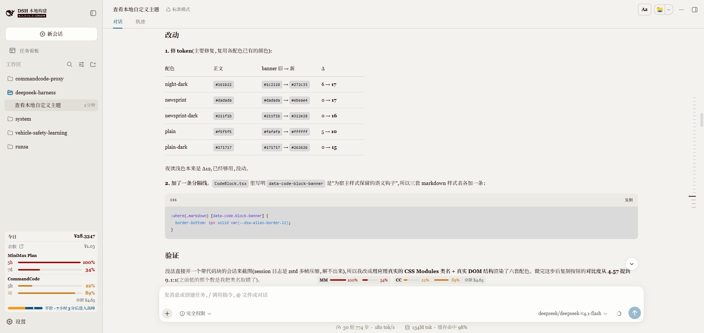

# 报纸衬线 · Newsprint Serif

一个 DSH 主题插件，把 [Typora](https://typora.io/) `newsprint` 主题的报纸排版气质搬进 DSH Web GUI。纯 CSS，无 hooks，无图片资产。



- **亮色** — 暖白纸张 `#f3f2ee`，墨色正文 `#1f0909`，全篇只有一个海蓝强调色 `#065588`。
- **暗色** — 不另配一套配色。切到暗色时由 DSH 官方的 `[data-ds-dark-theme]` 流程接管，呈现中性黑（自带 stock dark），排版笔画照旧生效。
- **正文** — 整套换成衬线栈：Georgia → PT Serif → 思源宋体 → 宋体。

## 安装

本插件独立，不依赖任何市场、皮肤中心或第三方商店——它就是一个普通的 profile bundle，只用 `dsh plugin` 装。

```sh
# 从仓库装
dsh plugin --profile web add github:2754LM/dsh-theme-newsprint

# 或装预构建包（不拉整个仓库）
dsh plugin --profile web add https://github.com/2754LM/dsh-theme-newsprint/releases/latest/download/dsh-theme-newsprint.tgz
```

装完刷新页面；若主题没出现，重启一次 dsh（bundle 列表在启动时读取）。

## 启用 / 停用 / 卸载

- **停用 / 重新启用**：编辑 `~/.dsh/profiles/web/cordis.patch.yml`

  ```yaml
  - id: newsprint
    disabled: true    # true = 停用；false 或删掉这一行 = 启用
  ```

  加载器会热重载。装上但未启用时，DSH 整页与官方主题完全一致，没有任何排版泄露。
- **卸载**：

  ```sh
  dsh plugin --profile web remove dsh-theme-newsprint
  ```

> 多主题并存：同时启用两个主题会互相叠加，只留一个启用，其余写上 `disabled: true`。

## 它带来了什么

报纸版面的性格不在配色上，而在**笔画**上。除了把亮档配色整套换掉，正文排版也按报纸重做：

| 元素 | 处理 |
| --- | --- |
| `h1` | 下方一条 1px 细线，常规字重，上方留 2em |
| `h3` | 回到常规字重 — 对比交给 h1/h2，而不是逐级加粗 |
| `blockquote` | 5px 粗左边框 + 斜体 + 弱化墨色 |
| `thead th` | 大写 |
| `tr:nth-child(even)` | 斑马行 |
| `hr` | 只留一条 1px 底线 |
| 链接 | 静止无下划线，悬停才出现 |
| 代码块 | 用官方 `--dsw-alias-markdown-code-block`，加 `1px` 下边线隔开 banner |
| 行内代码 | 用官方 `--dsw-alias-markdown-inline-code` |
| 任务列表 | checkbox 留 0.5em 右内边距 |
| 图片题注 | 暗砖红调（私有 `--newsprint-image-caption`） |

字体穿透到正文走两条路：

1. `body` 上设 `font-family: var(--dsw-font-family)`（chrome 走这条）；
2. `[data-dsh-part='message-body']` 和 `[data-chat-anchor-key]` 上显式再设一次（markdown 走这条），不赌 DSH 内部那条 `var(--dsw-font-markdown-base-font-family)` 链路以后会不会被重构掉。

锚点选的是稳定属性（`[data-chat-anchor-key]` / `[data-dsh-part='message-body']` / `.md-code-block` / `[data-code-block-banner]`），不选 `.markdown` 哈希类（那玩意编译后会变 `_markdown_<hash>`，字面量选择器永远落空）。

## 形态

`cordis 埋点插件`：package.json 里声明 `dsh.bundle.patch`（自带 `cordis.patch.yml`，插入 loader 条目 `id: newsprint`）与 `dsh.client`（web 平台）。**不依赖** `@deepseek-ai/dsh-client-ui-theme` 运行时，也不调 `ctx.theme.register()`，没有任何市场侧或皮肤中心的运行时依赖。

宿主半边 `apply()` 是空实现；client 半边只做一件事：往 `<head>` 塞一个 `<style id="dsh-theme-newsprint-styles">`（亮档 token + L3 排版），并在 `html` 上加 `dsh-newsprint-active` 类把作用域限住；fiber dispose 时移除 class 与 `<style>`。

好处是抗 DSH client 拓扑变更——`dsh-client-runtime` 被拆成 controller 那次（0.1.5-rc.2），所有走 `ctx.theme` 的主题插件都翻车了；本插件只往 DOM 注 CSS，免疫。代价是失去 dshmarket 主题选择器的「亮/暗档切换」能力（因为根本不接入 `ctx.theme`），所以暗档交给 DSH 官方。

## 许可

[MIT](LICENSE)。字体均调用系统已有的字族，不内嵌任何字体文件。
